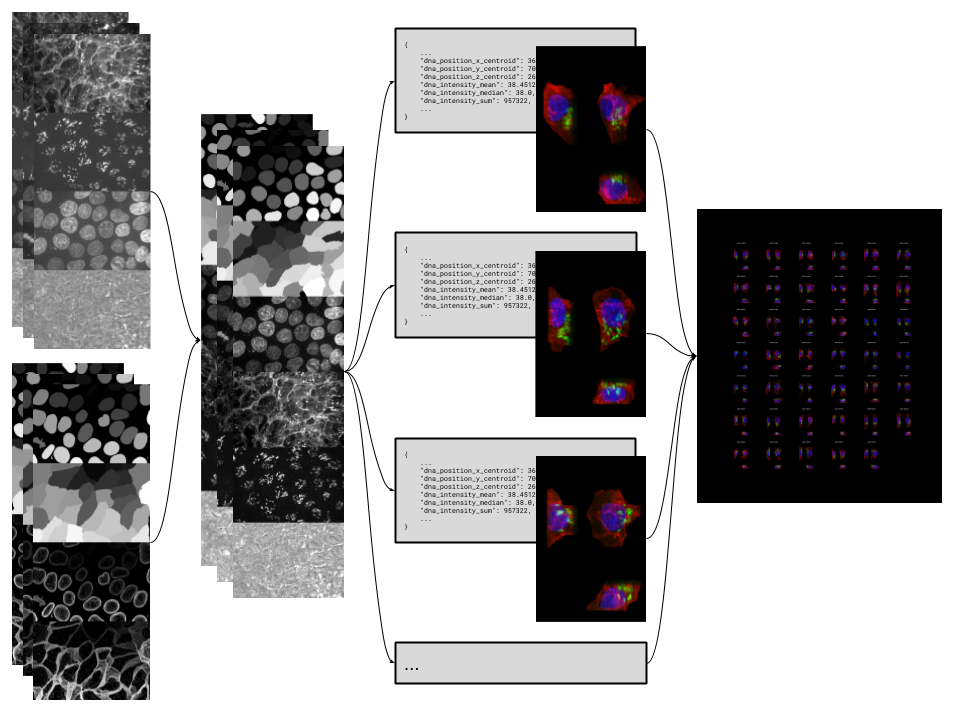

# actk

[](https://github.com/AllenCellModeling/actk/actions)
[](https://AllenCellModeling.github.io/actk)
[](https://codecov.io/gh/AllenCellModeling/actk)

Automated Cell Toolkit

A pipeline to process field-of-view (FOV) microscopy images and generate data and
render-ready products for the cells in each field. Of note, the data produced by this
pipeline is used for the [Cell Feature Explorer](https://cfe.allencell.org/).



---

## Features
All steps and functionality in this package can be run as single steps or all together
by using the command line.

In general, all commands for this package will follow the format:
`actk {step} {command}`

* `step` is the name of the step, such as "StandardizeFOVArray" or "SingleCellFeatures"
* `command` is what you want that step to do, such as "run" or "push"

Each step will check that the dataset provided contains the required fields prior to
processing. For details and definitions on each field, see our
[dataset fields documentation](https://AllenCellModeling.github.io/actk/dataset_fields.html).

An example dataset can be seen [here](https://open.quiltdata.com/b/aics-modeling-packages-test-resources/tree/actk/test_data/data/example_dataset.csv).

### Pipeline
To run the entire pipeline from start to finish you can simply run:

```bash
actk all run --dataset {path to dataset}
```

Step specific parameters can additionally be passed by simply appending them.
For example: the step `SingleCellFeatures` has a parameter for
`cell_ceiling_adjustment` and this can be set on both the individual step run level and
also for the entire pipeline with:

```bash
actk all run --dataset {path to dataset} --cell_ceiling_adjustment {integer}
```

See the [steps module in our documentation](https://AllenCellModeling.github.io/actk/actk.steps.html)
for a full list of parameters for each step

#### Pipeline Config

A configuration file can be provided to the underlying `datastep` library that manages
the data storage and upload of the steps in this workflow.

The config file should simply be called `workflow_config.json` and be available from
whichever directory you run `actk` from. If this config is not found in the current
working directory, defaults are selected by the `datastep` package.

Here is an example of our production config:

```json
{
    "quilt_storage_bucket": "s3://allencell",
    "project_local_staging_dir": "/allen/aics/modeling/jacksonb/results/actk"
}
```

You can even additionally attach step-specific configuration in this file by using the
name of the step like so:

```json
{
    "quilt_storage_bucket": "s3://example_config_7",
    "project_local_staging_dir": "example/config/7",
    "example": {
        "step_local_staging_dir": "example/step/local/staging/"
    }
}
```

#### AICS Distributed Computing

For members of the AICS team, to run in distributed mode across the SLURM cluster add
the `--distributed` flag to the pipeline call.

To set distributed cluster and worker parameters you can additionally add the flags:
* `--n_workers {int}` (i.e. `--n_workers 100`)
* `--worker_cpu {int}` (i.e. `--worker_cpu 2`)
* `--worker_mem {str}` (i.e. `--worker_mem 100GB`)

### Individual Steps
* `actk standardizefovarray run --dataset {path to dataset}`, Generate standardized,
ordered, and normalized FOV images as OME-Tiffs.
* `actk singlecellfeatures run --dataset {path to dataset}`, Generate a features JSON
file for each cell in the dataset.
* `actk singlecellimages run --dataset {path to dataset}`, Generate bounded 3D images
and 2D projections for each cell in the dataset.
* `actk diagnosticsheets run --dataset {path to dataset}`, Generate diagnostic sheets
for single cell images. Useful for quality control.

## Installation
**Install Requires:** The python package, `numpy`, must be installed prior to the
installation of this package: `pip install numpy`

**Stable Release:** `pip install actk`<br>
**Development Head:** `pip install git+https://github.com/AllenCellModeling/actk.git`

## Documentation
For full package documentation please visit
[allencellmodeling.github.io/actk](https://allencellmodeling.github.io/actk/index.html).

## Development
See
[CONTRIBUTING.md](https://github.com/AllenCellModeling/actk/blob/master/CONTRIBUTING.md)
for information related to developing the code.

For more details on how this pipeline is constructed please see
[cookiecutter-stepworkflow](https://github.com/AllenCellModeling/cookiecutter-stepworkflow)
and [datastep](https://github.com/AllenCellModeling/datastep).

To add new steps to this pipeline, run `make_new_step` and follow the instructions in
[CONTRIBUTING.md](https://github.com/AllenCellModeling/actk/blob/master/CONTRIBUTING.md)

### Developer Installation
The following two commands will install the package with dev dependencies in editable
mode and download all resources required for testing.

```bash
pip install -e .[dev]
python scripts/download_test_data.py
```

### AICS Developer Instructions
If you want to run this pipeline with the Pipeline Integrated Cell dataset
(`pipeline 4.*`) run the following commands:

```bash
pip install -e .[all]
python scripts/download_aics_dataset.py
```

Options for this script are available and can be viewed with:
`python scripts/download_aics_dataset.py --help`

***Free software: Allen Institute Software License***
